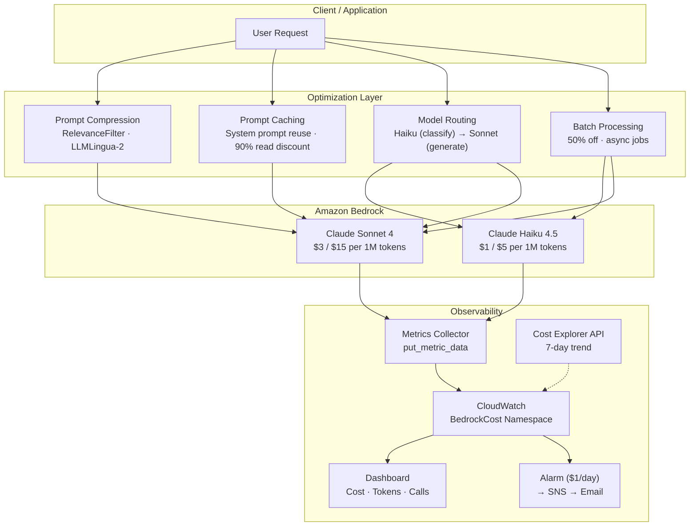

# AI Solutions Architect Portfolio

> End-to-end AWS Bedrock cost optimization: 4 strategies benchmarked, real CloudWatch monitoring, and a live AI Daily Digest pipeline — all in one monorepo.

## Architecture



## Key Results

Benchmarked on Claude Sonnet 4 with LongBench dataset (2K–10K word contexts):

| Strategy | Technique | Cost Reduction | Quality Impact |
|----------|-----------|:-:|:-:|
| **Prompt Compression** | RelevanceFilter (TF-IDF + Jaccard) | **76.3%** | No degradation (4/5 judge pass) |
| **Prompt Compression** | LLMLingua-2 (local BERT) | 34.4% | Minor (3/5 judge pass) |
| **Model Routing** | Haiku for scoring, Sonnet for generation | **~25x cheaper** on filtering step | Equivalent for classification |
| **Prompt Caching** | System prompt cache reads | 20.6% | No impact |
| **Batch Processing** | Async batch API | 50.0% | No impact |

> Full benchmark: [`testing/BENCHMARK_RESULTS_SUMMARY.md`](systems/s1-cost/testing/BENCHMARK_RESULTS_SUMMARY.md) · Model selection guide: [`docs/model-selection-matrix.md`](systems/s1-cost/docs/model-selection-matrix.md)

## Prerequisites

- **Python** ≥ 3.13
- **[uv](https://docs.astral.sh/uv/)** — package manager
- **Node.js** — required for AWS CDK CLI
- **AWS CLI** configured with credentials (`aws sts get-caller-identity` should work)
- **AWS IAM permissions**:
  ```
  bedrock:InvokeModel
  bedrock:InvokeModelWithResponseStream
  cloudwatch:PutMetricData
  sns:Publish
  ce:GetCostAndUsage
  ```
- **Bedrock model access** enabled for: Claude Haiku 4.5, Claude Sonnet 4

## Quick Start

```bash
# Clone and setup
git clone https://github.com/yepengfan/ai-sa-portfolio.git
cd ai-sa-portfolio/systems/s1-cost

# Install dependencies
uv sync --extra dev

# Run the AI Daily Digest (fetches RSS, scores, summarizes, writes to Obsidian)
uv run python -m digest

# Run with dry-run (no AWS, stdout only)
uv run python -m digest --stdout --no-metrics --top-n 3

# Deploy CloudWatch infrastructure (Dashboard + Alarm + SNS)
cd infra && npx aws-cdk@latest deploy --app "uv run python3 app.py"

# Run tests
uv run pytest digest/tests/ -v         # 21 digest tests
cd infra && uv run pytest tests/ -v    # 10 CDK tests
```

## Project Structure

```
ai-sa-portfolio/
├── systems/
│   └── s1-cost/                        # System #1 — Cost Optimization
│       ├── digest/                     # AI Daily Digest pipeline
│       │   ├── main.py                 # Pipeline orchestration + CLI
│       │   ├── feeds.py                # 92 Karpathy-curated RSS feeds
│       │   ├── sources/rss.py          # Async RSS fetcher
│       │   ├── dedup.py                # Jaccard dedup
│       │   ├── scoring.py              # Haiku batch scoring
│       │   ├── summarizer.py           # Sonnet bilingual summary
│       │   └── report.py              # Obsidian markdown output
│       ├── infra/                      # CDK infrastructure
│       │   ├── stacks/monitoring_stack.py
│       │   └── tests/
│       ├── utils/                      # Shared utilities
│       │   ├── bedrock.py              # Converse API wrapper
│       │   ├── metrics.py              # CloudWatch metrics
│       │   └── config.py               # Model IDs + pricing
│       ├── benchmark/                  # LongBench experiments
│       ├── strategies/                 # Compression implementations
│       ├── docs/                       # Model selection matrix
│       └── testing/                    # Benchmark results
├── portfolio/                          # Portfolio projects (planned)
└── docs/                               # Design documents
```

## Systems Overview

### [System #1: Cost Optimization](systems/s1-cost/README.md) (`s1-cost/`)

**Bedrock Optimization Strategies** — 4 cost reduction strategies benchmarked and deployed

- **Prompt Compression**: 5 techniques (RelevanceFilter, LLMLingua-2, Semantic Summarizer, Structure Optimizer, Manual Refiner)
- **Prompt Caching**: System prompt reuse with 90% read discount
- **Model Routing**: Haiku-as-filter, Sonnet-as-generator pattern
- **Batch Processing**: 50% off via async batch API
- **AI Daily Digest**: Live pipeline — 92 RSS feeds → Haiku scoring → Sonnet bilingual summary → Obsidian
- **CloudWatch Monitoring**: CDK-deployed Dashboard, Alarm ($1/day), SNS email alerts
- **Status**: ✅ Complete

### System #2–4 (Planned)

| System | Focus | Status |
|--------|-------|--------|
| `s2-pipeline` | ML/AI Pipeline & Orchestration | Planned |
| `s3-ha` | High Availability & Fault Tolerance | Planned |
| `s4-observability` | Observability Platform | Planned |

## Blog

[**AI Inference Eats 80% of Your Budget — I Benchmarked 4 Strategies to Cut It**](https://medium.com/@yepengfan/ai-inference-eats-80-of-your-budget-i-benchmarked-4-strategies-to-cut-it-f93b3e4b605a)

Published on Medium. Covers all 4 optimization strategies with real benchmark data from Claude Sonnet 4 on Amazon Bedrock.

## Roadmap

- ✅ **Phase 1**: s1-cost — Bedrock cost optimization (compression, caching, routing, batch)
- ✅ **Phase 1**: AI Daily Digest — Live Bedrock pipeline with CloudWatch monitoring
- ✅ **Phase 1**: CloudWatch infrastructure — CDK Dashboard + Alarm + SNS
- **Next**: s2-pipeline — ML orchestration and data processing
- **Future**: Complete all 4 systems + 3 portfolio projects
