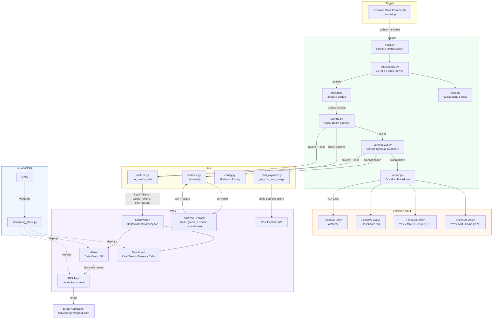

# AI Daily Digest — Architecture

```mermaid
graph TB
    subgraph Trigger["Trigger"]
        OBS["Obsidian Shell Commands<br/>on startup"]
    end

    subgraph Digest["digest/"]
        MAIN["main.py<br/>Pipeline Orchestration"]
        RSS["sources/rss.py<br/>90 RSS Feeds (async)"]
        DEDUP["dedup.py<br/>Jaccard Dedup"]
        SCORE["scoring.py<br/>Haiku Batch Scoring"]
        SUMM["summarizer.py<br/>Sonnet Bilingual Summary"]
        REPORT["report.py<br/>Obsidian Markdown"]
        FEEDS["feeds.py<br/>92 Karpathy Feeds"]
    end

    subgraph Utils["utils/"]
        BED["bedrock.py<br/>converse()"]
        MET["metrics.py<br/>put_metric_data"]
        CFG["config.py<br/>Models + Pricing"]
        CE["cost_explorer.py<br/>get_cost_and_usage"]
    end

    subgraph AWS["AWS"]
        BR["Amazon Bedrock<br/>Haiku (score) / Sonnet (summarize)"]
        CW["CloudWatch<br/>BedrockCost Namespace"]
        DASH["Dashboard<br/>Cost Trend / Tokens / Calls"]
        ALARM["Alarm<br/>Daily Cost > $1"]
        SNS["SNS Topic<br/>bedrock-cost-alert"]
        CEX["Cost Explorer API"]
    end

    subgraph Infra["infra/ (CDK)"]
        STACK["monitoring_stack.py"]
        TEST["tests/"]
    end

    subgraph Output["Obsidian Vault"]
        ZH["Feeds/AI-Daily/<br/>YYYY-MM-DD.md (中文)"]
        EN["Feeds/AI-Daily/<br/>YYYY-MM-DD-en.md (EN)"]
        DASHMD["Feeds/AI-Daily/<br/>Dashboard.md"]
        ARCHIVE["Feeds/AI-Daily/<br/>archive/"]
    end

    EMAIL["Email Notification<br/>fanyepeng97@gmail.com"]

    OBS -- python -m digest --> MAIN

    MAIN --> RSS
    RSS --> FEEDS
    RSS -- articles --> DEDUP
    DEDUP -- unique articles --> SCORE
    SCORE -- top N --> SUMM
    SUMM -- summarized --> REPORT

    SCORE -- Haiku batches --> BED
    SUMM -- Sonnet zh+en --> BED
    BED -- converse --> BR
    BR -- text + usage --> BED

    SCORE -- tokens + cost --> MET
    SUMM -- tokens + cost --> MET
    MET -- InputTokens / OutputTokens / InferredCost --> CW

    CE -- daily Bedrock spend --> CEX

    REPORT --> ZH
    REPORT --> EN
    REPORT --> DASHMD
    REPORT -- >14 days --> ARCHIVE

    CW --> DASH
    CW --> ALARM
    ALARM -- threshold breach --> SNS
    SNS -- email --> EMAIL

    STACK -. deploys .-> DASH
    STACK -. deploys .-> ALARM
    STACK -. deploys .-> SNS
    TEST -. validates .-> STACK

    style AWS fill:#f6f0ff,stroke:#8b5cf6
    style Digest fill:#f0fdf4,stroke:#22c55e
    style Utils fill:#fefce8,stroke:#eab308
    style Infra fill:#eff6ff,stroke:#3b82f6
    style Output fill:#fff7ed,stroke:#f97316
```
