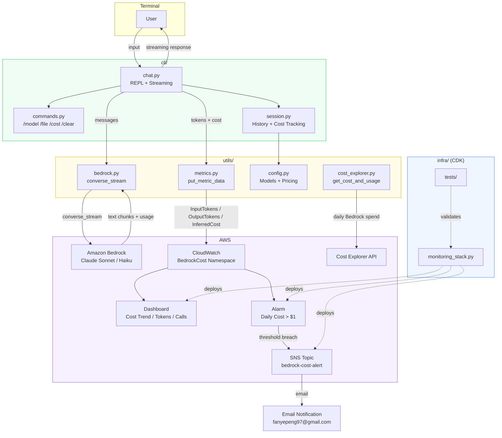

# Nano Claude Code — Architecture

```mermaid
graph TB
    subgraph User["Terminal"]
        U[User]
    end

    subgraph CLI["cli/"]
        CHAT["chat.py<br/>REPL + Streaming"]
        CMD["commands.py<br/>/model /file /cost /clear"]
        SESS["session.py<br/>History + Cost Tracking"]
    end

    subgraph Utils["utils/"]
        BED["bedrock.py<br/>converse_stream"]
        MET["metrics.py<br/>put_metric_data"]
        CFG["config.py<br/>Models + Pricing"]
        CE["cost_explorer.py<br/>get_cost_and_usage"]
    end

    subgraph AWS["AWS"]
        BR["Amazon Bedrock<br/>Claude Sonnet / Haiku"]
        CW["CloudWatch<br/>BedrockCost Namespace"]
        DASH["Dashboard<br/>Cost Trend / Tokens / Calls"]
        ALARM["Alarm<br/>Daily Cost > $1"]
        SNS["SNS Topic<br/>bedrock-cost-alert"]
        CEX["Cost Explorer API"]
    end

    subgraph Infra["infra/ (CDK)"]
        STACK["monitoring_stack.py"]
        TEST["tests/"]
    end

    EMAIL["Email Notification<br/>fanyepeng97@gmail.com"]

    U -- input --> CHAT
    CHAT -- streaming response --> U
    CHAT --> CMD
    CHAT --> SESS
    SESS --> CFG

    CHAT -- messages --> BED
    BED -- converse_stream --> BR
    BR -- text chunks + usage --> BED

    CHAT -- tokens + cost --> MET
    MET -- InputTokens / OutputTokens / InferredCost --> CW

    CE -- daily Bedrock spend --> CEX

    CW --> DASH
    CW --> ALARM
    ALARM -- threshold breach --> SNS
    SNS -- email --> EMAIL

    STACK -. deploys .-> DASH
    STACK -. deploys .-> ALARM
    STACK -. deploys .-> SNS
    TEST -. validates .-> STACK

    style AWS fill:#f6f0ff,stroke:#8b5cf6
    style CLI fill:#f0fdf4,stroke:#22c55e
    style Utils fill:#fefce8,stroke:#eab308
    style Infra fill:#eff6ff,stroke:#3b82f6
```
