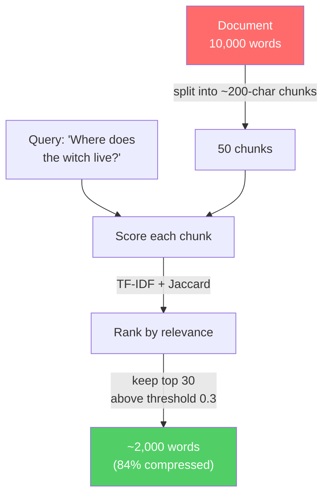
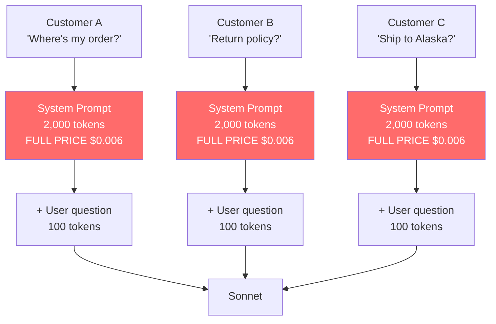
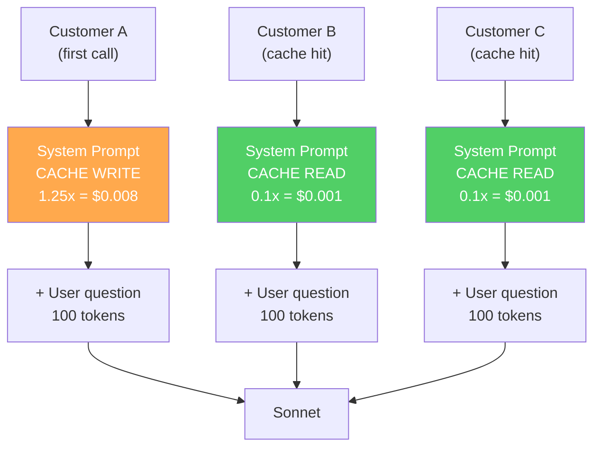
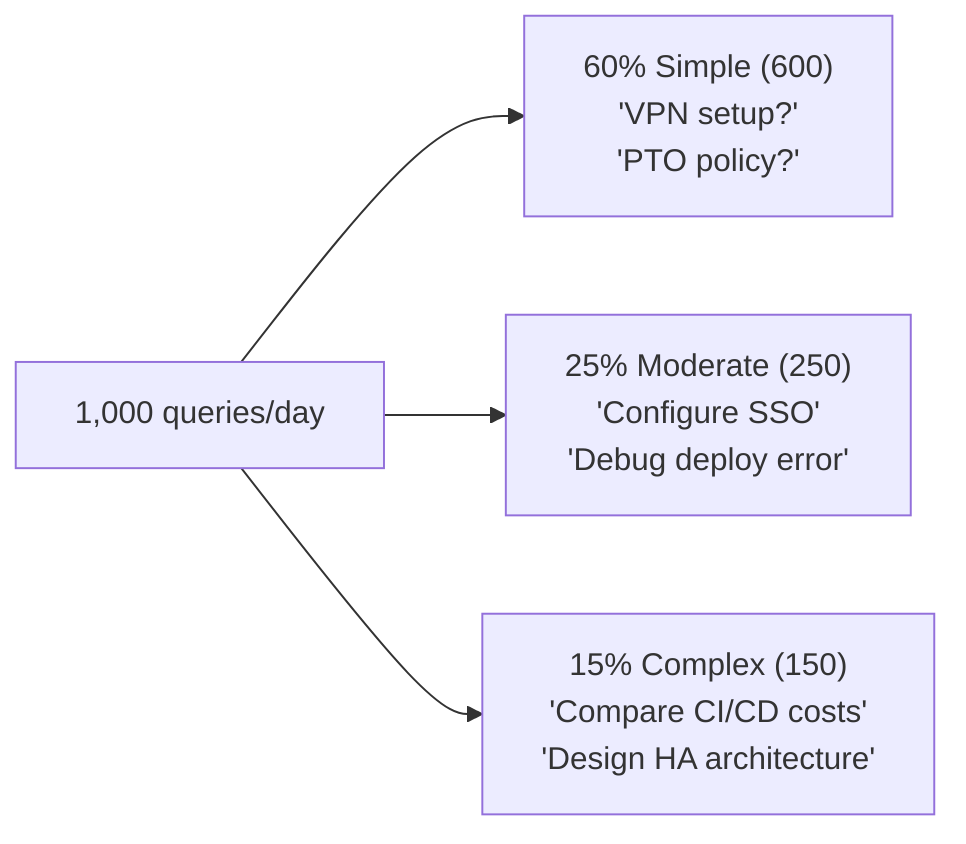
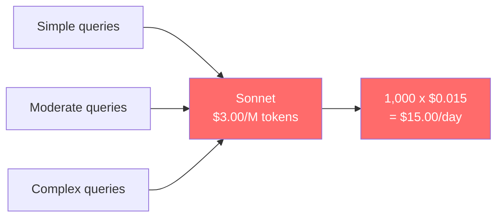
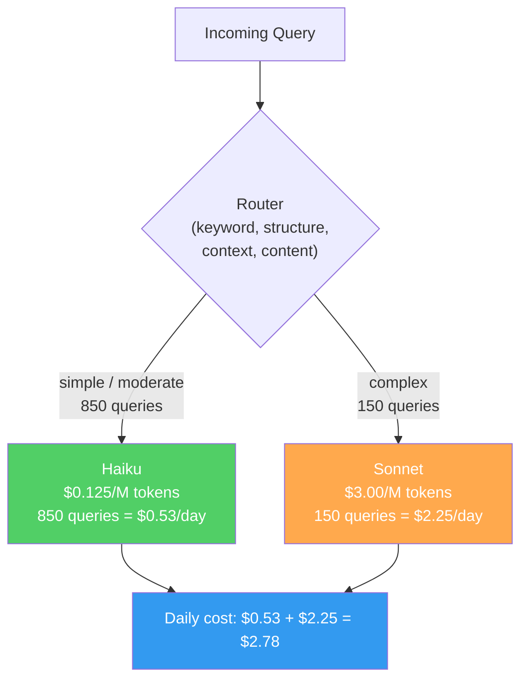
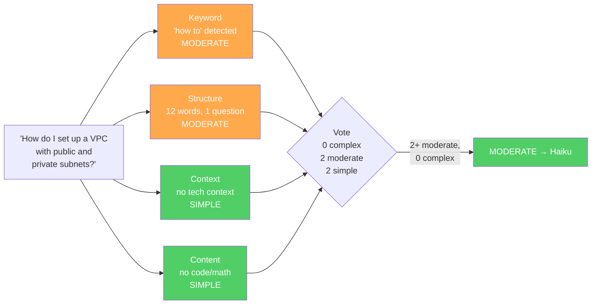
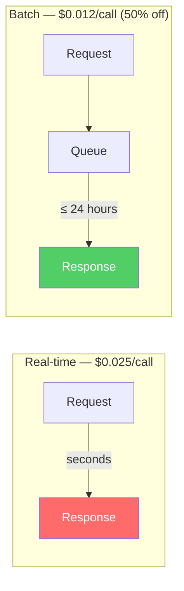

# AI Inference Eats 80% of Your Budget? I Benchmarked 4 Strategies to Cut It

LLM inference costs add up fast. A single Claude Sonnet 4 call with a 3,000-token input costs ~$0.025 — at 1,000 calls per day, that's $750/month. For most AI applications, inference is the dominant cost, far exceeding development or infrastructure. The industry offers many optimization strategies: prompt compression, prompt caching, model routing, batch processing. Each promises significant savings, but how do they actually perform?

I built and benchmarked 4 strategies (with 8 technique variants) on Amazon Bedrock with real API calls, real cost measurements, and the LongBench academic evaluation dataset. The results challenge some common assumptions about what works best.

## The 5 Compression Strategies

All five strategies share the same interface: take a text input, return a compressed version plus metrics. They differ fundamentally in *how* they decide what to keep and what to discard.

### 1. Manual Refiner — Regex-Based Text Cleanup

The simplest approach. Uses regular expressions to strip filler words, collapse whitespace, remove redundant phrases, and shorten common patterns. No ML, no API calls, purely mechanical.

```
Input:  "In order to effectively optimize the overall system performance..."
Output: "To optimize system performance..."
```

**Cost**: Zero. Runs locally with regex.

### 2. Semantic Summarizer — LLM-Powered Summarization

Sends the text to a cheaper model (Claude Haiku 4.5) with instructions to summarize while preserving key information. A `max_length_ratio` parameter controls the target compression level.

```
Input:  [800-word architecture description]
→ Haiku prompt: "Summarize to ~50% of original length, preserve technical details"
Output: [~200-word summary]
```

**Cost**: ~$0.003 per compression call (Haiku input + output tokens).

### 3. Relevance Filter — TF-IDF + Jaccard Chunk Selection

This strategy answers a simple question: **which parts of this document actually matter for the user's query?** It splits the context into fixed-size chunks (~200 characters), scores each chunk's relevance to the query, then keeps only the highest-scoring ones.

Two classic NLP techniques do the scoring:

- **TF-IDF cosine similarity** measures how much the chunk and query share *meaningful* words. TF-IDF (Term Frequency-Inverse Document Frequency) downweights common words like "the" and "is" while amplifying distinctive terms like "witch" or "mountain". Cosine similarity then compares the weighted word vectors — a chunk about "the witch's mountain cavern" scores high against the query "Where does the witch live?" because they share rare, meaningful terms.

- **Jaccard overlap** is simpler: what fraction of unique words appear in both the chunk and the query? It acts as a complementary signal — if TF-IDF misses a match due to vocabulary differences, Jaccard can catch direct word overlaps.

The two scores are combined, and chunks are ranked. Two parameters control how aggressively to filter: `similarity_threshold` (minimum score to keep a chunk) and `max_chunks` (maximum number of chunks to keep).



**Cost**: Zero. Both TF-IDF and Jaccard are computed locally with basic math — no model, no API call.

### 4. Structure Optimizer — Format Conversion

Converts prose into structured formats (JSON, bullet points, or markdown tables). The idea is that structured formats convey the same information in fewer tokens.

```
Input:  "The system uses three EC2 instances of type m5.xlarge running in us-east-1..."
Output: {"instances": {"type": "m5.xlarge", "count": 3, "region": "us-east-1"}}
```

**Cost**: Zero. Rule-based transformation.

### 5. LLMLingua Compressor — LLM Token Pruning

Inspired by the LLMLingua paper (Microsoft, 2023), this strategy uses a language model to score token importance and prune low-information tokens. Our initial implementation used Claude Haiku as the scoring model (approximating the approach). We later added real LLMLingua-2, which uses a fine-tuned BERT model (`microsoft/llmlingua-2-bert-base-multilingual-cased-meetingbank`) running locally on CPU.

```
Input:  "The normalized least mean square algorithm is engaged in the PLMS-PPIC method"
→ BERT scores each token's importance
→ Prune tokens below threshold (rate=0.5)
Output: "normalized least mean square algorithm engaged PLMS-PPIC method"
```

**Cost**: Haiku version ~$0.002/call. BERT version: zero (local inference).

## First Round: Why We Dropped Two Strategies

We ran all 5 strategies (plus real LLMLingua-2) on a custom prompt — an AWS Solutions Architect scenario with a ~1,800-token system prompt and ~800-token architecture context, evaluated against Claude Sonnet 4.

The results immediately revealed two strategies with limited practical value:

**Manual Refiner achieved only 4% compression** on technical text. Regex patterns designed for conversational filler ("in order to", "it is important to note that") barely match in architecture descriptions full of proper nouns and precise specifications. The approach works in theory but breaks down on domain-specific content.

**Structure Optimizer produced either quality collapse or minimal compression.** Converting technical prose to JSON sometimes discarded critical context, and for already-structured text (bullet points, numbered lists), there was nothing to optimize.

**LLMLingua (Haiku version) had negative ROI.** The Haiku API cost for scoring and pruning exceeded the Sonnet savings from the compression. Using an LLM to compress prompts sent to another LLM only makes economic sense if the compression model is dramatically cheaper — which Haiku is, but not by enough at low compression rates.

This left three strategies worth deeper investigation:

| Strategy | Why it survived |
|---|---|
| **LLMLingua-2 (BERT)** | Real token-level pruning, zero cost, literature backing |
| **RelevanceFilter** | High compression on long contexts, zero cost, query-aware |
| **SemanticSummarizer** | Highest compression potential, established technique |

## Experiment Design

### Dataset: LongBench

We used [LongBench](https://github.com/THUDM/LongBench), a standard academic benchmark for long-context understanding. We selected 5 samples across two task types:

- **multifieldqa_en** (3 samples, 2K-8K words): Factual question answering over academic papers
- **narrativeqa** (2 samples, 5K-10K words): Comprehension questions about literary texts

Each sample includes a long context, a question, and ground truth answers — enabling quality evaluation beyond just compression ratios.

### Parameter Sweep

We tested 10 strategy variants to find optimal configurations:

- **LLMLingua-2**: rate=0.5 (single config, BERT-based)
- **SemanticSummarizer**: 4 ratios (0.5, 0.6, 0.7, 0.8)
- **RelevanceFilter**: 5 threshold/chunk combinations (t0.7/c10, t0.5/c20, t0.3/c30, t0.3/c50, t0.3/c80)

### Evaluation

Three complementary metrics:

1. **LLM-as-judge** (primary): Haiku reads the question, ground truth answer, and model output, then returns YES/NO on correctness. Most interpretable — directly answers "did compression break the answer?"
2. **Token F1** (secondary): Standard SQuAD-style token overlap between model output and ground truth. Measures whether key answer tokens appear in the output.
3. **ROUGE-L** (reference): Longest common subsequence between compressed and baseline outputs. Measures output consistency rather than correctness.

### Baseline

All compressed outputs are compared against uncompressed Sonnet 4 output (temperature=0). The baseline itself scores 4/5 on judge pass rate — one question (about the Kondo effect in superconductivity) was too nuanced for even the full-context model to answer correctly per the ground truth.

## Results

### The Numbers

| Strategy | Compression | Cost Saving | Judge Pass | API Cost |
|---|---|---|---|---|
| **Baseline (no compression)** | — | — | **4/5** | $0.038/call |
| LLMLingua-2 (BERT) | 38.0% | 34.4% | 3/5 | **$0** |
| RelevanceFilter t0.3_c30 | 84.2% | 76.3% | **4/5** | **$0** |
| RelevanceFilter t0.3_c50 | 72.2% | 63.5% | **4/5** | **$0** |
| RelevanceFilter t0.3_c80 | 54.3% | 48.2% | **4/5** | **$0** |
| SemanticSummarizer 0.5 | 79.5% | 59.6% | 3/5 | ~$0.003 |
| SemanticSummarizer 0.6 | 83.6% | 66.1% | 1/5 | ~$0.003 |
| SemanticSummarizer 0.7 | 78.3% | 59.4% | 2/5 | ~$0.003 |
| SemanticSummarizer 0.8 | 81.4% | 64.4% | 3/5 | ~$0.003 |

### Compression Rates vs Literature

| Strategy | Our Data | Literature Reference | Verdict |
|---|---|---|---|
| LLMLingua-2 | 38% | 30-50% | Consistent |
| RelevanceFilter | 54-84% | 50-70% (Selective Context) | Consistent to slightly above |
| SemanticSummarizer | 76-81% | 60-80% | Consistent |

## Key Insights

### 1. RelevanceFilter is the surprise winner

RelevanceFilter t0.3_c30 compressed 84% of the context while maintaining the same answer quality as the uncompressed baseline (4/5 judge pass). The technique is conceptually simple — TF-IDF + Jaccard scoring on text chunks — but it works because most long documents contain large amounts of information irrelevant to the specific question being asked.

The key insight: **query-aware compression fundamentally outperforms query-agnostic compression** for QA tasks. If you know what the user is asking, you can aggressively discard everything else.

### 2. Compression can improve output quality

Both LLMLingua-2 and RelevanceFilter showed *higher* Token F1 scores than the uncompressed baseline. This "less is more" effect has been documented in the literature — removing noise helps the model focus on relevant information rather than getting distracted by irrelevant context.

### 3. LLM-based compression has a cost problem

SemanticSummarizer achieves high compression rates (76-81%) but each compression call costs ~$0.003 in Haiku API fees. For a Sonnet call averaging $0.038, that's an 8% overhead eating into savings. More critically, the Haiku model doesn't reliably follow length instructions — setting `max_length_ratio` to 0.5 vs 0.8 produces outputs differing by only ~5 percentage points in compression, because the model generates what it considers a "good summary" regardless of the target length.

### 4. Zero-cost methods have the best ROI

LLMLingua-2 (local BERT) and RelevanceFilter (local TF-IDF) both achieve meaningful compression with zero API cost. Every token they remove translates directly to savings on the inference call. This makes them strictly dominant over API-based compression for most use cases.

### 5. One metric isn't enough

ROUGE-L against baseline output (our initial evaluation method) produced universally low scores (0.25-0.40) that were hard to interpret. Adding Token F1 against ground truth and LLM-as-judge revealed that many "low ROUGE-L" outputs were actually correct answers, just worded differently. The judge metric proved most actionable: "Did the compressed prompt still produce a correct answer? Yes or No."

## Beyond Compression: Three More Strategies

Compression reduces what you send. But there are other ways to cut costs: cache what you've sent before, route to cheaper models, or trade latency for discounts. We benchmarked all three using the same AWS Solutions Architect prompt (1,871-token system prompt + 1,178-token user message).

### Strategy 6: Prompt Caching — Pay Once, Reuse Cheap

**Core idea: The system prompt is the same every time. Why pay to process it from scratch on every call?**

Every LLM API call processes your entire input — including the system prompt, which rarely changes between requests. Prompt caching tells the provider to store this repeated prefix server-side. The first call writes it to cache (small premium); every subsequent call reads from cache at 90% discount.

On Bedrock, this is a native feature requiring one extra field: `cache_control: {"type": "ephemeral"}`. The cache has a 5-minute TTL that resets on each use. No infrastructure to manage.

#### Use Case: Customer Support Bot

An e-commerce company runs a support bot on Bedrock. Every conversation uses the same 2,000-token system prompt (policies, procedures, product rules).

**Without caching** — 500 conversations/day, each reprocessing the same 2,000 tokens:



> System prompt cost: 500 x $0.006 = **$3.00/day**

**With caching** — first call writes cache, remaining 499 calls read at 0.1x:



> System prompt cost: $0.008 + 499 x $0.001 = **$0.51/day** (was $3.00)

#### Our Benchmark

We tested with our AWS SA prompt (1,871-token system prompt + 1,178-token user message):

```
Cold call:  $0.0203  (1,871 tokens written to cache at 1.25x)
Warm call:  $0.0138  (1,871 tokens read from cache at 0.1x)
No caching: $0.0189
```

**Result: 26.7% saving per warm call. Breaks even after 4 calls.**

At 1,000 calls/day: **$5.10/day → $153/month saved** from adding one field to the API request.

### Strategy 7: Model Routing — Right Model for the Job

**Core idea: Not every question requires the most expensive model. Route simple questions to a cheap model, save the expensive model for hard problems.**

Claude Sonnet 4 costs $3.00 per million input tokens. Claude Haiku 4.5 costs $0.125 — **24x cheaper**. Haiku can't match Sonnet on complex reasoning, but for "What is S3?" or "How do I create a VPC?", the answers are equally good. Model routing classifies each query's complexity and sends it to the cheapest model that can handle it.

#### Use Case: Internal Knowledge Base

A company deploys an AI assistant for 1,000 employees. Typical daily traffic:



**Without routing** — all 1,000 queries go to Sonnet:



**With routing** — classifier sends 85% of traffic to Haiku:



> Daily cost: **$2.78** (was $15.00)

#### How Our Router Classifies

Four independent analyzers vote on complexity:



Conservative bias: if *any* analyzer votes "complex", the query goes to Sonnet. Better to overspend on one query than return a bad answer.

#### Our Benchmark

We tested 5 queries, calling both Haiku and Sonnet for each:

| Query | Router Decision | Haiku Cost | Sonnet Cost | Saving |
|---|---|---|---|---|
| "What is Amazon S3?" | haiku | $0.00024 | $0.00460 | $0.0044 |
| "List the five pillars of WAF" | haiku | $0.00012 | $0.00319 | $0.0031 |
| "How to set up VPC with subnets?" | haiku | $0.00064 | $0.01543 | $0.0148 |
| Complex architecture optimization | sonnet | — | $0.02451 | — |
| Aurora Serverless v2 trade-offs | sonnet | — | $0.01553 | — |

**Result: 35.1% saving across the query mix.** The VPC query — a moderate how-to — saved $0.0148 alone, showing that moderate queries generate the most savings: expensive enough on Sonnet to matter, simple enough for Haiku to handle.

### Strategy 8: Batch Processing — Trade Time for Money

**Core idea: If you don't need answers in real-time, you can get the exact same output at half the price.**

Bedrock Batch Inference queues your requests and processes them within 24 hours. In exchange for giving up instant responses, you get a flat 50% discount on all token costs. Same model, same output quality — just delayed.



| Model | Realtime | Batch | Saving |
|---|---|---|---|
| Sonnet | $0.02451 | $0.01225 | 50.0% |
| Haiku | $0.00102 | $0.00051 | 50.0% |

At scale (1,000 Sonnet calls/day), that's **$367/month saved** with zero code changes to prompt or output.

Best for: nightly evaluation runs, bulk document processing, training data generation, compliance reviews — anything where you don't need results immediately.

*Note: Batch results are based on Bedrock's published pricing. Caching and routing results are from real API measurements.*

## The Complete Picture

Here's every strategy we tested, ranked by cost saving:

| Strategy | Saving | Quality Impact | Cost to Implement | Requires |
|---|---|---|---|---|
| **Batch Processing** | 50.0% | None | None | 24h latency tolerance |
| **RelevanceFilter t0.3_c30** | 76.3%* | None (4/5 judge) | Low | Query available |
| **Model Routing** | 35.1% | Lower on complex tasks | Low | Query classifier |
| **Prompt Caching** | 26.7% | None | Minimal | Repeated system prompt |
| **SemanticSummarizer** | 59-66%* | Moderate (1-3/5 judge) | Medium | Haiku API calls |
| **LLMLingua-2** | 34.4%* | Slight (3/5 judge) | Medium | Local BERT model |

*Compression savings measured on LongBench (long documents). Savings on shorter prompts will be lower.

### Strategies Stack

These strategies are not mutually exclusive. A production system could combine:

1. **Prompt Caching** on system prompt (always-on, no downside)
2. **Model Routing** to send simple queries to Haiku
3. **RelevanceFilter** to trim long contexts before sending to either model
4. **Batch Processing** for non-interactive workloads

The combined theoretical saving: caching (26.7%) + routing on simple queries (35.1%) + compression on long contexts (76.3%) — though the actual combined saving depends on workload mix and isn't simply additive.

## Practical Recommendations

**Start here (5 minutes):** Add `cache_control: {"type": "ephemeral"}` to your system prompt. Instant 20-27% saving on repeated prompts with zero quality impact.

**If you have mixed-complexity queries:** Add a keyword-based router. Simple factual queries go to Haiku at 1/24th the cost. Even a basic classifier saves 30%+ on typical workloads.

**If you have long contexts with queries** (RAG, document QA): Add RelevanceFilter with threshold 0.3 and 30-50 chunks. 70-84% compression at zero cost, zero quality loss.

**If you can tolerate latency:** Use Batch Processing for any non-interactive workload. 50% saving, zero effort.

**If you need general-purpose compression** (no query available): Use LLMLingua-2 with rate=0.5. Stable, free, works on any text.

## Limitations

- Compression experiments used 5 LongBench samples — directional but not statistically significant
- Routing results depend on query distribution; your mix will differ
- Batch saving is based on published pricing, not a live batch job
- Combined strategy savings are theoretical; interaction effects not measured
- RelevanceFilter requires a query; not applicable to query-free scenarios

---

*All experiments ran on Amazon Bedrock with Claude Sonnet 4 and Haiku 4.5. Total benchmark cost: ~$1.05. Code and results are available in the [ai-sa-portfolio](https://github.com/yepengfan/ai-sa-portfolio) repository under `systems/s1-cost/benchmark/`.*
